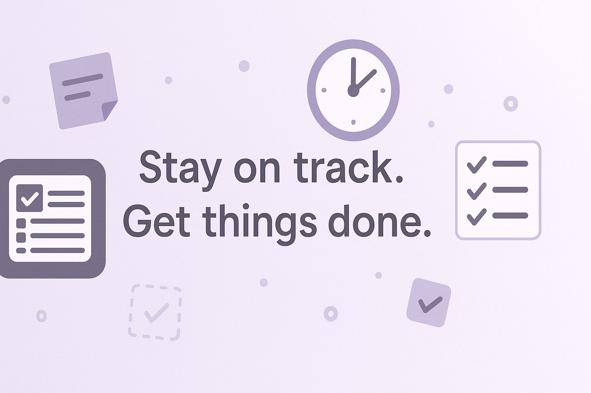

# todo-list# Todo Manager Pro

[](https://www.odoo.com)
[](https://opensource.org/licenses/MIT)
[](https://github.com)

A professional task management application for Odoo 17 with modern UI design and powerful productivity features. Perfect for teams and individuals who want to stay organized and boost their productivity.

<!-- Banner -->


<!-- Screenshots -->
### 📱 App Screenshots


## ✨ Features

### 🎯 Core Task Management
- **Create & Organize Tasks** - Rich task creation with descriptions, notes, and attachments
- **Smart Prioritization** - 5-level priority system (Low → Normal → Medium → High → Urgent)
- **Effort Tracking** - Built-in effort estimation (15 min → Multiple days)
- **Due Date Management** - Smart deadline tracking with overdue alerts
- **User Assignment** - Assign tasks to team members
- **Progress Tracking** - Visual progress indicators and completion percentages

### 🔄 Workflow Management
- **Status Workflow** - Complete lifecycle: Draft → Todo → In Progress → Review → Done
- **Bulk Operations** - Perform actions on multiple tasks at once
- **Archive System** - Keep your workspace clean while preserving completed tasks
- **Time Tracking** - Track estimated vs actual time spent

### 📊 Multiple Views
- **Kanban Board** - Visual workflow with drag-and-drop cards
- **List View** - Detailed table with sorting and filtering
- **Form View** - Comprehensive task details with tabs and analytics

### 🎨 Modern Interface
- **Professional Design** - Clean, modern UI with responsive layout
- **Smart Notifications** - Color-coded alerts for overdue and urgent tasks
- **Advanced Search** - Powerful filtering and grouping options
- **Mobile Friendly** - Works perfectly on all devices

## 🚀 Quick Start

### Installation

1. **Download the module**
   ```bash
   cd /path/to/odoo/addons
   git clone <repository-url> todo_app
   ```

2. **Restart Odoo** and update apps list

3. **Install Todo Manager Pro**
   - Go to Apps menu in Odoo
   - Search for "Todo Manager Pro"
   - Click Install

4. **Access the app**
   - Find "Todo Manager" in your main menu
   - Start creating tasks!

### First Steps

1. **Create your first task** - Click "Create" in My Tasks
2. **Set priority and effort** - Use the dropdowns to categorize
3. **Add due date** - Set deadlines to stay on track
4. **Start working** - Use "Start Working" button to begin
5. **Track progress** - Watch the progress bar update automatically

## 📖 How to Use

### Creating Tasks

1. **Navigate** to Todo Manager → My Tasks
2. **Click "Create"** button
3. **Fill in details**:
   - **Task Name**: Clear, actionable description
   - **Priority**: Choose urgency level
   - **Effort Level**: Estimate time needed
   - **Due Date**: Set deadline
   - **Description**: Add detailed requirements
4. **Save** your task

### Managing Tasks

#### Using the Kanban Board
- **Drag and drop** cards between status columns
- **Quick actions** via the dropdown menu on each card
- **Visual indicators** for priority and deadlines
- **Progress bars** show completion status

#### Using the List View
- **Bulk select** tasks with checkboxes
- **Inline editing** for quick updates
- **Sort by** any column (priority, due date, etc.)
- **Filter and search** to find specific tasks

#### Task Actions
- **Start Working** - Mark task as in progress
- **Mark Complete** - Finish a task
- **Set Priority** - Change urgency level
- **Archive** - Move completed tasks out of view
- **Duplicate** - Create copies of similar tasks

### Bulk Operations

Select multiple tasks in list view and use:
- **Mark as Done** - Complete several tasks at once
- **Set High Priority** - Urgent batch updates
- **Archive Selected** - Clean up your workspace
- **Start Work** - Begin multiple tasks
- **Reset to Todo** - Move tasks back to planning

### Search & Filters

#### Quick Filters
- **My Tasks** - Your assigned tasks
- **Active** - Current work items
- **Completed** - Finished tasks
- **Overdue** - Past due items
- **High Priority** - Urgent tasks

#### Advanced Search
- Search in task names and descriptions
- Filter by assigned user
- Group by status, priority, or date
- Custom date ranges

## 🎯 Workflow

```
📝 Draft → ✅ Todo → 🔄 In Progress → 👁️ Review → ✅ Done
                                                      ↓
                                               📦 Archive
```

### Task Statuses
- **Draft** - Initial planning phase
- **Todo** - Ready to start
- **In Progress** - Currently working
- **Review** - Waiting for approval
- **Done** - Completed successfully
- **Cancelled** - No longer needed

### Priority Levels
- **🔴 Urgent** - Drop everything else
- **🟠 High** - Important, do soon
- **🟡 Medium** - Normal priority
- **🟢 Normal** - Standard tasks
- **⚪ Low** - When you have time

## 🔧 Configuration

### User Permissions
- **Regular Users** - Manage their own tasks
- **System Admins** - Access all tasks
- **Portal Users** - View assigned tasks only

### Settings
Access via Settings → Technical → Parameters:
- Configure notification settings
- Customize status workflows

## 🔮 Future Features

### Version 2.1 - Coming Soon
- **📱 Mobile App** - Native iOS and Android apps
- **⏱️ Time Tracking** - Built-in timer with start/stop/pause
- **📋 Task Templates** - Pre-defined templates for common workflows
- **📊 Analytics Dashboard** - Performance metrics and trends
- **🔔 Smart Notifications** - Email and push notifications

### Version 2.2 - Planned
- **🤖 AI Features** - Smart task prioritization and effort estimation
- **📅 Calendar Integration** - Sync with Google Calendar and Outlook
- **💬 Team Chat** - Built-in communication for tasks
- **📈 Advanced Reports** - Custom reporting with charts and exports
- **🔗 Integrations** - Connect with Slack, Teams, Jira, and more

### Version 3.0 - Long Term
- **🎯 Project Management** - Full project planning with Gantt charts
- **💰 Budget Tracking** - Cost management per task and project
- **🏢 Multi-Company** - Support for multiple organizations
- **🔄 Workflow Automation** - Custom automated processes
- **📱 Offline Mode** - Work without internet connection

## 🛠️ Technical Requirements

- **Odoo Version**: 17.0 or higher
- **Python**: 3.8+
- **Database**: PostgreSQL
- **Browser**: Modern browsers (Chrome, Firefox, Safari, Edge)

## 📞 Support

- **📚 Documentation**: Check this README and in-app help
- **🐛 Bug Reports**: Create an issue in the repository
- **💡 Feature Requests**: Use the discussions tab
- **📧 Email**: zinebac12@example.com

## 📄 License

Licensed under MIT. See LICENSE file for details.